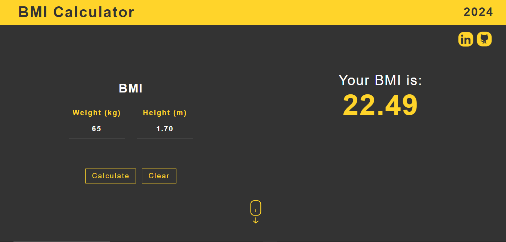
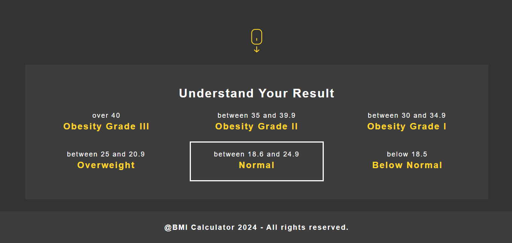
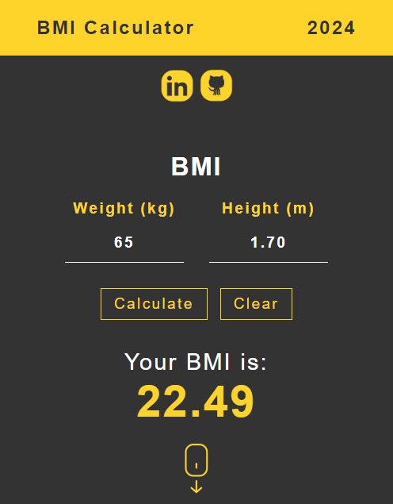

# **Calculator BMI**

## Sobre o projeto

Clique e acesse o projeto: [calulator-bmi-react](https://react-js-calculator-bmi.vercel.app/)

Trabalho realizado com o framework React Js, com uso de Typescript, HTML5, CSS3 e Flexbox. 

Com layout resposivo e dinâmico, o site trabalha fazendo o cálculo do IMC e o exibe ao usuário. É necessário informar o peso e a altura para esta finalidade. O cálculo consiste na divisão do peso pela altura ao quadrado. Se os campos estiverem vazios o aplicativo informará que é necessário preencher os campos.

Usei o Styled Components para o estilo do layout, deixando mais organizado e atraente.

Trabalhei com componentes de cabeçalho, de rodapé e de conteúdo; dividindo as responsabilidades.

 

Work carried out with the React Js framework, using Typescript, HTML5, CSS3 and Flexbox.

With a responsive and dynamic layout, the site works by calculating the BMI and displays it to the user. It is necessary to provide weight and height for this purpose. The calculation consists of dividing weight by height squared. If the fields are empty, the application will inform you that it is necessary to fill in the fields.

I used Styled Components to style the layout, making it more organized and attractive.

I worked with header, footer and content components; dividing responsibilities.

## Seção de Resultado do Cálculo IMC

## Layout Mobile

## Tecnologias Utilizadas

* HTML5
* CSS3
* Flexbox
* Styled Components
* Typescript
* React Js

## Instalação

##### Instalar Dependências
<pre><code>npm install</code></pre>

##### Executar Aplicação
<pre><code>npm run dev</code></pre>

## Autor

#### **Katarine Albuquerque**

    
    &nbsp;
    

